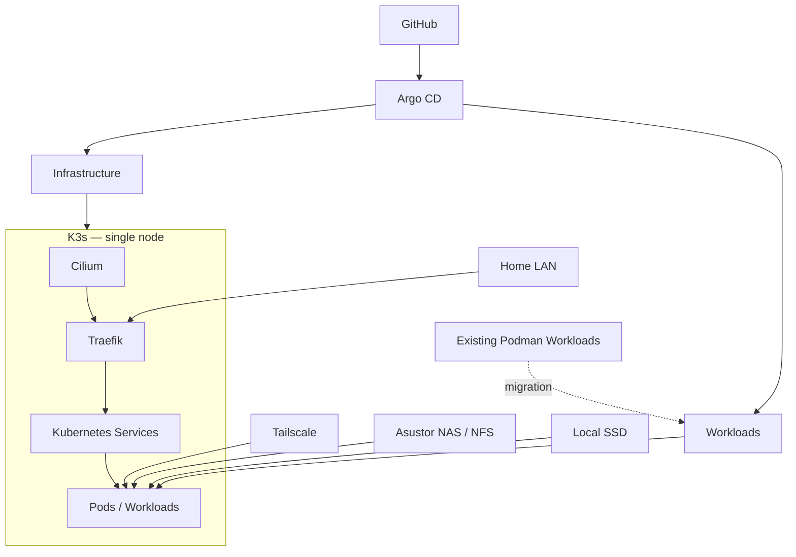

# HOMELAB

Self-hosted infrastructure on a **Minisforum MS-A2**, evolving from Podman workloads into a small, GitOps-managed Kubernetes platform.

[](https://github.com/shatadru/homelab/actions/workflows/super-linter.yml)
[](https://github.com/shatadru/homelab/blob/main/renovate.json)

## Architecture



**Cilium** provides networking, policy and Hubble observability. **Traefik** provides L7 ingress, while **Argo CD** manages the desired state through GitOps. Tailscale is used for selected remote access.

## Stack

| Area | Technology |
| --- | --- |
| Host | Minisforum MS-A2 · Fedora Linux |
| Kubernetes | K3s |
| Networking & Policy | Cilium · Hubble |
| GitOps | Argo CD |
| Ingress | Traefik · Kubernetes Ingress |
| Load Balancing | MetalLB |
| Remote Access | Tailscale Operator |
| TLS | cert-manager |
| Database | CloudNativePG |
| Observability | Prometheus · Grafana · Alertmanager |
| Uptime | Gatus |
| Dashboard | Homarr |
| Automation | Ansible · Renovate · GitHub Actions |

## Repository Layout

```text
homelab/
├── ansible/       # host and K3s automation
├── apps/          # Argo CD applications
├── bootstrap/     # initial/recovery configuration
├── charts/        # local Helm charts
├── clusters/      # cluster-level GitOps configuration
└── docs/          # documentation
```

`bootstrap/` establishes the base platform. `apps/` and `clusters/` define the desired runtime state managed by Argo CD.

## Workloads

Existing services are being migrated incrementally from Podman to Kubernetes:

- Immich
- Firecrawl
- SearXNG
- Hermes
- Open WebUI

Stateful workloads are migrated with backup, validation and rollback in mind. Existing Podman services remain in place until their Kubernetes replacements are proven.

## Storage

- **Local SSD** — PostgreSQL, Redis and latency-sensitive state
- **Asustor NAS / NFS** — durable shared data and large media such as the Immich library

The cluster is intentionally **single-node** for now.

## CI & Dependency Management

- **GitHub Actions** runs Super-Linter.
- **Renovate** tracks Helm charts and Helm values.
- Dependency updates are opened as PRs rather than automatically merged.

## Status

The Kubernetes foundation is operational. Current work is focused on storage readiness, network policies, ingress validation and safe workload migration.

> Personal homelab focused on learning, automation, reliability and pragmatic infrastructure design.
