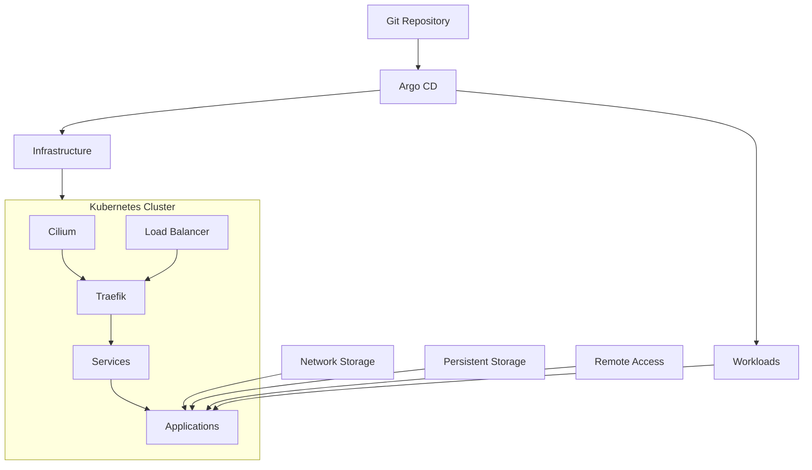

# HOMELAB

A self-hosted infrastructure platform built around Kubernetes, GitOps, and declarative configuration.

[](https://github.com/shatadru/homelab/actions/workflows/super-linter.yml)
[](https://github.com/shatadru/homelab/blob/main/renovate.json)

## Architecture



The platform uses **Argo CD** to reconcile the desired state from Git. **Cilium** provides networking, policy and observability, while **Traefik** handles ingress. Persistent data is separated from application workloads, with shared storage available where required.

## Stack

| Area | Technology |
| --- | --- |
| Kubernetes | K3s |
| Networking & Policy | Cilium · Hubble |
| GitOps | Argo CD |
| Ingress | Traefik · Kubernetes Ingress |
| Load Balancing | MetalLB |
| Remote Access | Tailscale Operator |
| TLS | cert-manager |
| Database | CloudNativePG |
| Observability | Prometheus · Grafana · Alertmanager |
| Uptime | Gatus |
| Automation | Ansible · Renovate · GitHub Actions |

## Repository Layout

```text
homelab/
├── ansible/       # automation
├── apps/          # Argo CD applications
├── bootstrap/     # cluster bootstrap
├── charts/        # Helm charts
├── clusters/      # GitOps configuration
└── docs/          # documentation
```

## GitOps

Infrastructure and workloads are defined declaratively and reconciled through Argo CD.

- Changes are reviewed through Git pull requests.
- Helm-based applications are managed from version-controlled configuration.
- Renovate keeps dependencies and chart versions up to date.
- GitHub Actions provides automated repository checks.

## Storage

Storage is treated independently from application deployment:

- Persistent local storage for stateful workloads
- Network storage for shared and large data
- Application configuration remains declarative and version controlled

## Applications

The platform is designed to host a range of self-hosted applications while keeping application configuration, networking, storage, security and observability managed consistently through the same GitOps workflow.

> A practical homelab for learning, automation, reliability, and modern infrastructure practices.
