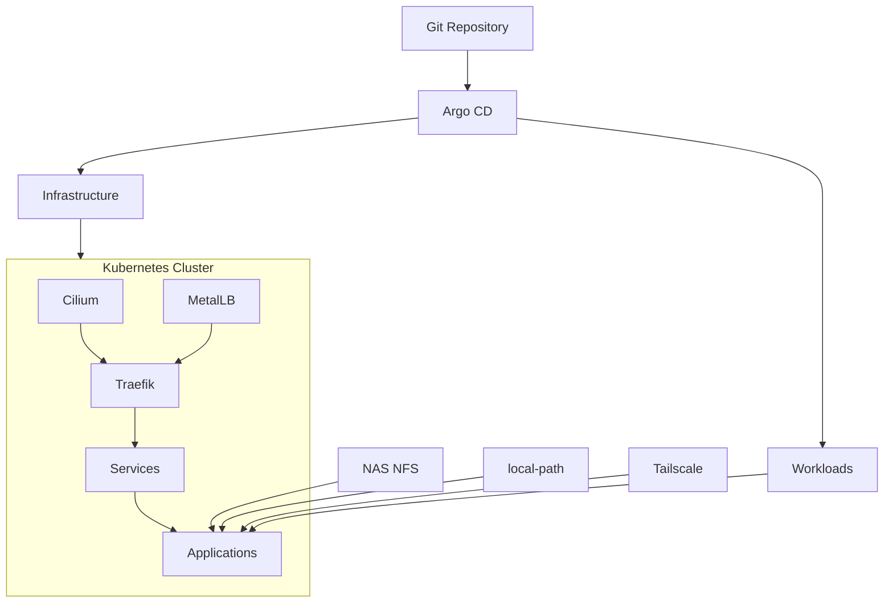

# HOMELAB

A self hosted Kubernetes platform for home services. Desired state lives in
Git. Argo CD keeps the cluster in sync.

[](https://github.com/shatadru/homelab/actions/workflows/super-linter.yml)
[](https://github.com/shatadru/homelab/actions/workflows/quality-checks.yml)
[](https://github.com/shatadru/homelab/blob/main/renovate.json)

## Start here

Full guides live under [`docs/`](docs/README.md):

- [Architecture](docs/architecture.md)
- [GitOps layout](docs/gitops.md)
- [Bootstrap](docs/bootstrap.md)
- [Applications](docs/applications.md)
- [Secrets and storage](docs/secrets-and-storage.md)
- [Testing and CI](docs/testing.md)

## How it fits together


```mermaid
graph TD
  G[Git Repository] --> A[Argo CD]
  A --> I[Infrastructure]
  A --> W[Workloads]

  subgraph K[Kubernetes Cluster]
    C[Cilium]
    LB[MetalLB]
    T[Traefik]
    S[Services]
    P[Applications]
    C --> T
    LB --> T
    T --> S --> P
  end

  I --> K
  W --> P
  N[NAS NFS] --> P
  D[local-path] --> P
  R[Tailscale] --> P
```

Argo CD uses an app of apps split:

- **Infrastructure** under `apps/infra` (Cilium, MetalLB, Traefik, cert-manager,
  CNPG, monitoring, Gatus, storage drivers, Tailscale operator, Argo CD, and
  Gateway API CRDs from the upstream Gateway API repository)
- **Workloads** under `apps/workloads` (Immich, Paperless-ngx, Homarr, OpenCloud)

## Stack

| Area | Technology |
| --- | --- |
| Kubernetes | K3s |
| Networking | Cilium |
| GitOps | Argo CD |
| Ingress | Traefik |
| Load balancing | MetalLB |
| Remote access | Tailscale Operator |
| TLS | cert-manager |
| Database | CloudNativePG |
| Observability | Prometheus, Grafana, Alertmanager |
| Uptime | Gatus |
| Automation | Renovate, GitHub Actions (Ansible planned) |

## Repository layout

```text
homelab/
├── ansible/       # Host bootstrap (not complete yet)
├── apps/          # Argo CD Application manifests
├── bootstrap/     # One time K3s and Argo CD install
├── charts/        # Helm wrapper charts
├── clusters/      # Root GitOps entry points
├── docs/          # Human friendly guides
└── scripts/       # Lint and Kind install helpers
```

## Local checks

Same checks CI runs for YAML and Helm rendering. The Helm CLI must be on
`PATH`:

```bash
pip install tox
tox                       # yamllint + helm charts
tox -e yamllint
tox -e helm-charts -- argocd
```

Kind install tests (needs Docker, Kind, kubectl, Helm):

```bash
tox -e kind-charts
# or
./scripts/kind-chart-install.sh
```

See [Testing and CI](docs/testing.md) for what Kind covers and what it skips.
