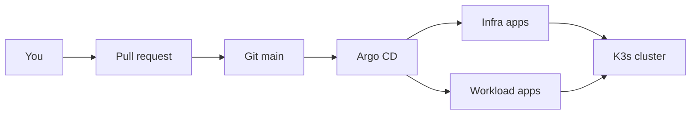

# Homelab docs

This is the guide for the GitOps homelab in this repository. Start here if you
are new to the repository, then follow the links that match what you need.

## What this platform is

A single Kubernetes cluster (K3s) that runs home services. Desired state lives
in Git. Argo CD keeps the cluster matched to that state.

You change the cluster by merging a pull request. Day to day work inside an
app still happens in that app.

## Read next

| Topic | When to read it |
| --- | --- |
| [Architecture](architecture.md) | You want the big picture and how pieces connect |
| [GitOps layout](gitops.md) | You want to add or change an app the right way |
| [Bootstrap](bootstrap.md) | You are rebuilding the bare cluster from scratch |
| [Applications](applications.md) | You care about what runs today and where it lives |
| [Secrets and storage](secrets-and-storage.md) | An app is stuck Pending or CrashLooping on secrets or disks |
| [Testing and CI](testing.md) | You want local checks or how GitHub Actions validates changes |

## Mental model



1. Edit charts or Argo Application manifests in this repository.
2. CI checks YAML and Helm rendering. Kind install tests cover a safe subset.
3. After merge, Argo CD syncs `main` into the cluster.

## Repository map

```text
homelab/
├── ansible/      # Future host bootstrap (not complete yet)
├── apps/         # Argo CD Application manifests
├── bootstrap/    # One-time K3s and Argo CD install
├── charts/       # Helm wrapper charts (what Argo actually deploys)
├── clusters/     # Root app-of-apps entry points
├── docs/         # You are here
└── scripts/      # Local and CI test helpers
```
