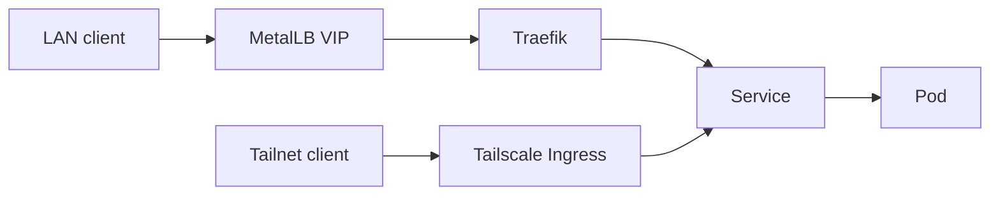

# Applications

Two groups: infrastructure (shared platform) and workloads (services you use).

## Infrastructure (`apps/infra`)

| Application | Chart | Namespace | Role |
| --- | --- | --- | --- |
| argo-cd | `charts/argocd` | `argocd` | GitOps UI and controllers |
| cilium | `charts/cilium` | `kube-system` | CNI and network policy |
| cert-manager | `charts/cert-manager` | `cert-manager` | Certificate requests |
| metallb | `charts/metallb` | `metallb-system` | LAN LoadBalancer IPs |
| traefik | `charts/traefik` | `traefik` | Ingress for internal hostnames |
| local-path | `charts/local-path` | `local-path-storage` | Node local StorageClass |
| nfs-csi | `charts/nfs-csi` | `nfs-csi` | Dynamic NFS StorageClass `nas-nfs` |
| cnpg | `charts/cnpg` | `cnpg-system` | Postgres operator |
| monitoring-stack | `charts/monitoring-stack` | `monitoring` | Prometheus, Grafana, Alertmanager |
| gatus | `charts/gatus` | `gatus` | Synthetic uptime checks |
| tailscale-operator | `charts/tailscale-operator` | `tailscale` | Tailnet Ingress |
| gateway-api-crds | upstream Gateway API repository | `kube-system` | Gateway API CRDs |

## Workloads (`apps/workloads`)

| Application | Chart | Namespace | Notes |
| --- | --- | --- | --- |
| immich | `charts/immich` | `immich` | Photos. CNPG + NFS library volume |
| paperless-ngx | `charts/paperless-ngx` | `paperless-ngx` | Documents. CNPG + nas-nfs |
| homarr | `charts/homarr` | `homarr` | Dashboard. sqlite on local-path |
| opencloud | `charts/opencloud` | `opencloud` | Files. nas-nfs data, local-path state |
| labforge | `charts/labforge` | `labforge` | KVM lab control plane. Pocket ID + oauth2-proxy login, ntfy chat |

## How traffic reaches apps

This repository does not create DNS. Point the LAN names below at `192.168.0.11`
yourself. Traefik serves `argocd.home.shatadru.in`,
`grafana.home.shatadru.in`, `prometheus.home.shatadru.in`,
`alertmanager.home.shatadru.in`, `gatus.home.shatadru.in`,
`homarr.home.shatadru.in`, `immich.home.shatadru.in`,
`paperless.home.shatadru.in`, `cloud.home.shatadru.in`,
`collabora.home.shatadru.in`, and `companion.home.shatadru.in`.
`id.home.shatadru.in` is the Pocket ID LAN alias from `charts/labforge`.
Tailscale Ingress short names are `immich`, `paperless`, `labforge`, and
`pocket-id`. Paperless also allows `paperless.tail8fbf37.ts.net` and
`paperless.shatadru.in`. The tunnel for `paperless.shatadru.in` is not in
this repository. `photos.shatadru.in`, `shatadru.in`, and `sonalstudio.in`
are Gatus checks, not Ingresses.

## Chart extras

A few wrappers ship more than values:

- Immich: CNPG `Cluster`, library PV and PVC templates
- Paperless: CNPG `Cluster`, Tailscale Ingress template
- LabForge: thin wrapper over the released OCI chart (`ghcr.io/shatadru/charts/labforge`); login and chat are subcharts of that chart
- MetalLB: `IPAddressPool` and `L2Advertisement`
- NFS CSI: `StorageClass` named `nas-nfs`
- Tailscale operator: default `ProxyClass` with resource limits
