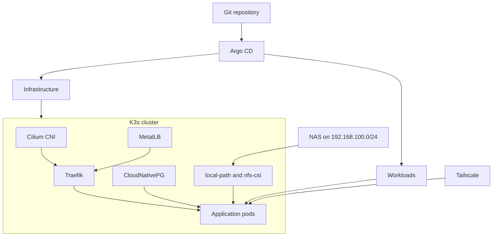

# Architecture

The homelab is a GitOps platform on a single K3s node. Networking, storage,
ingress, and databases are installed as infrastructure. User facing services
sit on top as workloads.

## High level

## Layers

| Layer | Job | Examples |
| --- | --- | --- |
| Bootstrap | Get a kubeconfig and a working Argo CD | K3s install, `bootstrap/argocd` |
| Infrastructure | Shared platform services | Cilium, MetalLB, Traefik, cert-manager, CNPG, monitoring |
| Workloads | Things you use day to day | Immich, Paperless-ngx, Homarr, OpenCloud |
| Access | How you reach services | Traefik on LAN, Tailscale on the tailnet |

## Networking snapshot

| Network | Purpose |
| --- | --- |
| `192.168.0.0/24` | Node LAN and MetalLB VIP pool |
| `192.168.100.0/24` | NAS / NFS only (not Kubernetes node traffic) |
| `10.42.0.0/16` | Pod CIDR |
| `10.43.0.0/16` | Service CIDR |

The first node is `minisforum-server` at `192.168.0.163`. MetalLB can hand out
addresses from `192.168.0.10` to `192.168.0.80`. Traefik requests
`192.168.0.11` from that pool. Gatus checks that address over HTTPS with
a Host header. The process listens on 8000. The Service still publishes
80 and 443, and port 80 redirects to HTTPS. Setting the container port
back to 80 makes the non-root pod fail.

## Storage split

Two patterns show up again and again:

- **local-path** for databases and small state that should stay on the node
- **nfs-csi / static NFS PVs** for large media libraries and shared datasets on
  the NAS

Workloads choose one or both. Immich keeps Postgres on local-path and the photo
library on a static NFS volume. Paperless keeps media on `nas-nfs` and Valkey
on local-path. Paperless also accepts `paperless.shatadru.in`, described in
its values as a Cloudflare Tunnel host. That tunnel is not defined in this
repository.

## Why wrapper charts

Each app under `charts/` is a thin Helm chart that depends on an upstream chart.
Homelab specific values live in that wrapper. Renovate can bump the upstream
version. Argo CD deploys the wrapper path, not a raw upstream URL with ad hoc
flags.
