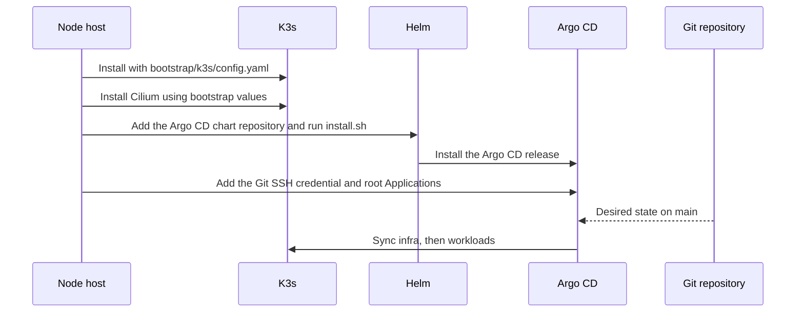

# Bootstrap

Bootstrap is the one time path that creates a cluster Argo CD can manage. After
that, Git owns almost everything else.

## What lives where

| Path | Purpose |
| --- | --- |
| `bootstrap/k3s/config.yaml` | K3s server flags, including kube-proxy disabled |
| `bootstrap/k3s/cilium-values.yaml` | First Cilium install values |
| `bootstrap/argocd/install.sh` | Helm install of Argo CD |
| `bootstrap/argocd/values.yaml` | Minimal Argo CD values for day zero |
| `ansible/` | Intended future automation. Not ready to rebuild the host yet. |

## Current node assumptions

Documented in `bootstrap/k3s/README.md`:

- K3s on `minisforum-server`
- Node IP `192.168.0.163`
- Cilium as CNI
- Dedicated NAS network kept off the Kubernetes node IP path

## Important drift warning

Bootstrap and GitOps do not use the same chart versions or the same values
shape.

- Day zero Argo CD is Helm chart `10.3.2`, installed from
  `bootstrap/argocd/values.yaml`. Those values are flat upstream keys.
  `charts/argocd` depends on chart `10.9.2`, and its values are nested under
  `argo-cd:`.
- Day zero Cilium uses `bootstrap/k3s/cilium-values.yaml`. GitOps Cilium is
  chart `1.20.2` with `kubeProxyReplacement: true`. K3s must be started with
  `disable-kube-proxy: true` before that sync. `bootstrap/k3s/config.yaml`
  sets that flag. A node that still runs kube-proxy will have two programs
  owning Service traffic after Argo CD syncs Cilium.
- `write-kubeconfig-mode` is `0600`, so the node kubeconfig is readable only
  by root.

Copying a wrapper `values.yaml` into the bootstrap Helm command does not work.
Those files are shaped for the wrapper chart, not the upstream release.

## Install order

Ansible cannot rebuild the host. `ansible/site.yml` calls roles that are not
in this repository.

1. Install K3s `v1.36.3+k3s1` with `bootstrap/k3s/config.yaml` as the server
   config. That file turns kube-proxy, Flannel, Traefik, ServiceLB, and
   local-storage off. The kubeconfig mode is `0600`, so it is root-only.
2. Install Cilium chart `1.20.2` from `https://helm.cilium.io/` as release
   `cilium` in `kube-system`, using `bootstrap/k3s/cilium-values.yaml`.
   Use that release name. A second Helm release installs a second CNI.
   Those values set `defaultLBServiceIPAM` to `none` so Cilium does not
   hold LoadBalancer addresses.
3. Confirm `kubectl` is pointed at this cluster. Add the Helm chart repository from
   `bootstrap/argocd/README.md`, then run `bootstrap/argocd/install.sh`.
   That script only installs Argo CD chart `10.3.2`. It does not register
   the Git repository.
4. Create a Secret in namespace `argocd` with label
   `argocd.argoproj.io/secret-type: repository`, `url`
   `git@github.com:shatadru/homelab.git`, and your SSH private key.
5. `kubectl apply -f clusters/production/infra.yaml` and wait until that
   Application is healthy. Then apply `clusters/production/workloads.yaml`.
   Applying the files under `apps/` directly skips the roots, so later
   adds and deletes in those directories will not be picked up.

Child sync waves are listed in the GitOps layout. Apply infra first anyway.
The first infra sync upgrades Argo CD from chart `10.3.2` to `10.9.2`, turns
on the ingress at `argocd.home.shatadru.in`, and asks `homelab-selfsigned`
for a certificate.

Applications are not installed by the bootstrap scripts on purpose. That keeps
the control plane bootstrap small and makes Git the source of truth for apps.
