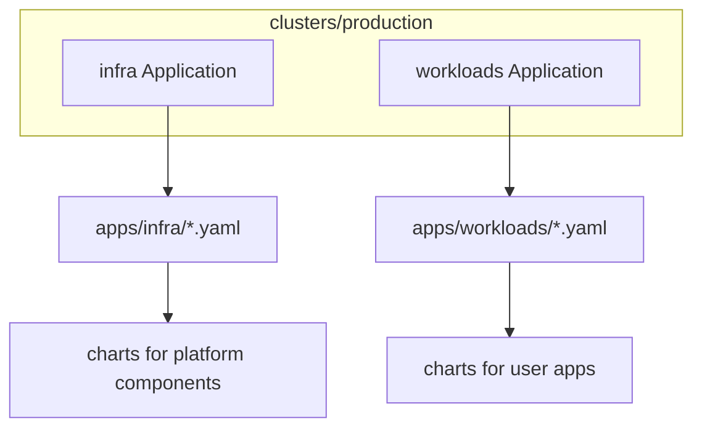

# GitOps layout

Argo CD is configured with an app of apps pattern. Two root Applications point
at directories of child Applications. Children point at Helm charts in this
repository.

## Entry points

| File | Watches | Deploys |
| --- | --- | --- |
| `clusters/production/infra.yaml` | `apps/infra/` | Platform Applications |
| `clusters/production/workloads.yaml` | `apps/workloads/` | Workload Applications |

Both roots use automated sync with self heal. Most Applications also use
server-side apply and create their target namespace when needed.

## Add a new workload

1. Create `charts/myapp/` with a `Chart.yaml` dependency on the upstream chart
   and a `values.yaml` nested under the dependency name.
2. Add `apps/workloads/myapp.yaml` pointing at `charts/myapp` and the right
   namespace.
3. Open a PR. Wait for CI. Merge. Argo CD creates the Application and syncs.

You do not need to edit the root `workloads` Application. It already recurses
the directory.

## Add platform infrastructure

Same idea, but place the Application under `apps/infra/`. Child Applications
carry `argocd.argoproj.io/sync-wave`. Wave -2 is Gateway API CRDs,
cert-manager, and Cilium. Wave -1 is MetalLB, Traefik, CNPG, local-path,
and nfs-csi. Wave 0 is monitoring, Gatus, Tailscale, and Argo CD. Wave 1
is the workloads. Both root Applications also retry a failed sync. Apply
infra first anyway.

## Source of truth details

Child Applications in this repository pin:

- `repoURL: git@github.com:shatadru/homelab.git`
- `targetRevision: main`
- `path: charts/<name>`

`apps/infra/gateway-api-crds.yaml` is the exception. It tracks
`https://github.com/kubernetes-sigs/gateway-api.git` at `v1.6.1`, path
`config/crd/standard`. Argo CD needs SSH access for this repository, and plain
HTTPS access for that Gateway API repository.

## Sync policy notes

Most Applications auto sync, self heal, create the namespace, and use server
side apply. The root Applications also prune, and each child has the resources
finalizer, so deleting a manifest deletes that Application and the resources
it owns. Paperless and OpenCloud also prune their own contents. Both Postgres
clusters set `Prune=false,Delete=false`. A sync prune skips those
Cluster objects, and deleting the Application does not delete them
either. The resources finalizer still removes the other objects that
Application owns.
OpenCloud now uses server-side apply, matching the other children.
