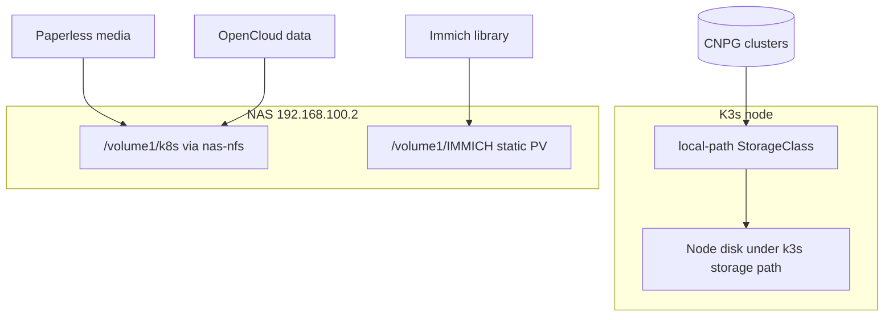

# Secrets and storage

Git holds desired state. It does not hold passwords. Several apps also need
storage that points at real hardware on the LAN. If a workload never becomes
Ready, check this page before debugging the chart.

## Secrets you create out of band

These Secret objects are referenced by charts but are not generated by this
repository.

| Secret | Namespace | Used by | Typical keys |
| --- | --- | --- | --- |
| `immich-db-credentials` | `immich` | Immich + Immich CNPG role | `username`, `password` |
| `paperless-secrets` | `paperless-ngx` | Paperless | `PAPERLESS_SECRET_KEY` |
| `paperless-db-credentials` | `paperless-ngx` | Paperless + Paperless CNPG role | `username`, `password` |
| `opencloud-admin-credentials` | `opencloud` | OpenCloud | `adminPassword` |
| `collabora-admin-credentials` | `opencloud` | Collabora | `username`, `password` |
| `db-encryption` | `homarr` | Homarr | `db-encryption-key` |
| `operator-oauth` | `tailscale` | Tailscale operator | `client_id`, `client_secret` |

The two database secrets must be type `kubernetes.io/basic-auth`. Set
`username` to the role (`immich` or `paperless`). The app charts read the
`password` key. Homarr's key can be created with `openssl rand -hex 32`.

Create the namespace first, or let the Application create it, then add the
Secret before expecting pods to become Ready. Collabora is enabled and
reads `collabora-admin-credentials`. If that Secret is missing, the
Collabora pod stays unready. Do not put the password in values.

Turning `createDemoUsers` off does not delete demo accounts that were
created the first time the pod started. Remove those users in OpenCloud
if they already exist.

## TLS issuer expectation

Immich, Paperless, Homarr, OpenCloud, Gatus, Grafana, Prometheus,
Alertmanager, and Argo CD request certificates from a ClusterIssuer named
`homelab-selfsigned`. The cert-manager wrapper ships that issuer. It is a
self-signed issuer, so clients still need to trust the generated certificates
or skip verification.

## Storage map

| Storage | How it is provided | Typical use |
| --- | --- | --- |
| `local-path` | Node disk at `/var/lib/rancher/k3s/storage`, reclaim Delete | Postgres, Homarr, Paperless Valkey |
| `nas-nfs` | nfs-csi to `/volume1/k8s`, reclaim Retain, mode 0755 | Paperless media, OpenCloud data |
| Static Immich PV | NFS to `/volume1/IMMICH`, reclaim Retain | Large photo library (9Ti claim) |

Deleting a `local-path` claim deletes the data on the node. Deleting an NFS
volume does not delete the NAS export. `nas-nfs` creates the volume root as
mode 0755. Paperless then mounts subpaths, and Kubernetes creates those
directories as root. If Paperless cannot write its media directories, fix the
permissions on the existing export. The pod runs as user 1000 and mounts
subpaths `data`, `media`, `consume`, and `export`. Changing the
StorageClass does not rewrite a volume that already exists.

Paperless Valkey now asks for `local-path`. If that volume was created
as `nas-nfs`, Kubernetes will not change `storageClassName` on it, and
the Paperless sync stays failed. Delete that cache PVC before the sync.
Do not expect the class change to move the data. Media stays on `nas-nfs`.

Neither `local-path` nor `nas-nfs` is the default StorageClass. A PVC
with no class stays Pending. K3s local-storage is disabled in
`bootstrap/k3s/config.yaml`.

NFSv3 mount options on the Immich PV and nfsvers=4.2 on `nas-nfs` are different
on purpose. Do not assume one style works for every workload. OpenCloud in
particular expects NFSv4.2 style behavior for posixfs.

## Quick failure checklist

1. Secret missing in the app namespace?
2. PVC stuck because NFS is unreachable from the node?
3. Certificate pending because cert-manager or `homelab-selfsigned` is unhealthy?
4. CNPG cluster waiting on `local-path` while the provisioner is unhealthy?
