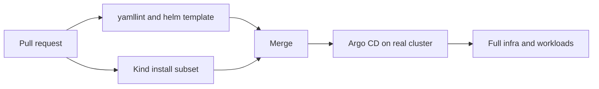

# Testing and CI

Two layers of protection: fast chart rendering checks, and a Kind install of
charts that can actually start without LAN hardware or private credentials.

## Local checks (same as CI lint jobs)

Needs Python 3.9+, [tox](https://tox.wiki), and the Helm CLI.

```bash
pip install tox
tox                       # yamllint + helm dependency/lint/template
tox -e yamllint
tox -e helm-charts -- argocd
```

`scripts/helm-chart-test.sh` walks every chart under `charts/`, builds
dependencies, lints, and runs `helm template`. That catches bad values and
broken chart metadata before Argo CD tries to sync.

## Kind install tests

Not every chart can be installed in GitHub Actions. Things that need a real NAS,
Tailscale OAuth, MetalLB LAN semantics beyond install, or large app secrets are
skipped on purpose.

The Kind job installs a small, high signal set:

| Chart | Why it is included |
| --- | --- |
| cert-manager | CRDs and the three Deployments become Available. The startup API check hook is off in CI |
| cnpg | Operator install health |
| metallb | Operator installs; pool CRs disabled in CI (need live CRDs) |
| traefik | Ingress controller starts with ClusterIP in CI |
| gatus | Simple workload chart with CI friendly config |
| argocd | Control plane chart renders and runs with ingress off |

Kind's node image already installs a default StorageClass named `standard`
(local-path provisioner). This repository's class is named `local-path`, and that
wrapper is not installed in CI, so a PVC that asks for `local-path` will not
bind there. Homarr and heavier workloads stay on `helm template` checks plus
the real cluster. Every chart still goes through `tox -e helm-charts`.

CI overlays live in `charts/<name>/ci/values.yaml`. They are merged on top of
the normal values so production settings stay the default.

The install script pins Kind to an isolated kubeconfig when it creates the
cluster, and refuses to continue unless the current context is
`kind-<cluster-name>` pointing at localhost. That keeps a bad context from
installing charts into another cluster on your machine.

```bash
# Deletes any existing kind cluster named homelab-ci, installs the set
# above, then deletes the cluster
./scripts/kind-chart-install.sh

# Use an existing kind-homelab-ci context. Set KUBECONFIG when that
# context is not in the default kubeconfig. GitHub Actions does this.
CREATE_CLUSTER=0 KUBECONFIG=/path/to/kind.kubeconfig ./scripts/kind-chart-install.sh
```

Or through tox when Docker, Kind, kubectl, and Helm are on your PATH:

```bash
tox -e kind-charts
```

## What Kind does not prove



Kind will not validate NFS mounts, Tailscale auth, Immich library volumes,
Paperless secrets, or Cilium on the physical node. Those still need a real
cluster (or a follow up test design with stubs).

## GitHub Actions

| Workflow | Job | Purpose |
| --- | --- | --- |
| `quality-checks.yml` | `yamllint` | YAML style |
| `quality-checks.yml` | `helm-charts` | Dependency build, lint, template |
| `quality-checks.yml` | `kind-charts` | Install the safe chart subset on Kind |
| `super-linter.yml` | `run-lint` | Extra lint on changed files. Kubeval is off |
